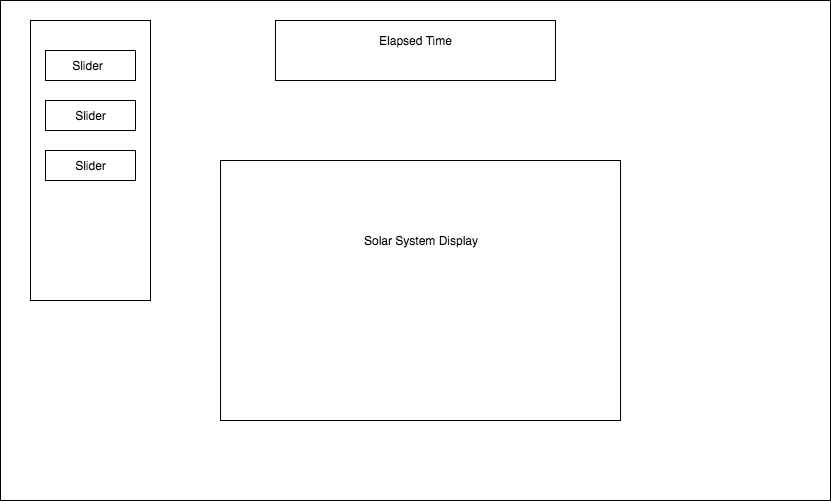

# Planetary
Planetary is a visualization that models the movement of a customized planetary system tailored to the user's specifications. The user can predetermine the number of celestial bodies in the system, their state of matter, mass, and other relevant properties and allow physics to take over when the visualization starts! Will your planets surive?

## Features

### Main Planetary View

The main view renders the currently created planets. By default, Earth's solar system is preloaded. Planetary orbit will be shown by a line. The star date will be shown as a time lapse reference.

### Side Bar

The user can choose to use the default solar system. The user can also choose to edit this solar system or create a custom one. Editable properties will include an explandable list of planets, their unique names, masses, densities, trajectories, speeds, and starting positions. The sidebar will include a play button to start the animation. This should be a clean and engaging interface with sliders. 

### Convincing Physics & Aditional Features

The planets will interact using real gravitational laws and approximations. To limit the scope of this project, orbits will be 2 dimensional. 

## Technologies 
This project will use the React library. Planets will be rendered to the DOM using React. Planetary movement logic will be handled by JavaScript. Positions will be kept track of using a grid with coordinate positions

## Implementation Timeline

### Day1
Get some basic rendering of planet objects on the DOM according to position with React. Research the necessary physics to govern the dom element movements and implement this logic in JavaScript.

### Day2
Have the DOM elements properly animate movement. Implement the sidebar with sliders to change the properties of the planets which will then influence their movement and physics. 

### Day3
Add styling and a background to make the user interface clean and enjoyable to use. 

## WireFrame

## Bonus Features 
Users should be able to click on a planet and see detailed information about it, as well as measure the approximate distance to another celestial body by clicking on a second planet/star. Add background music that can be muted.
